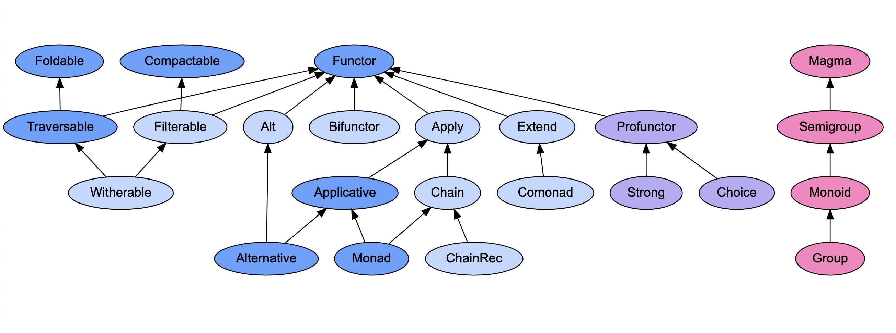
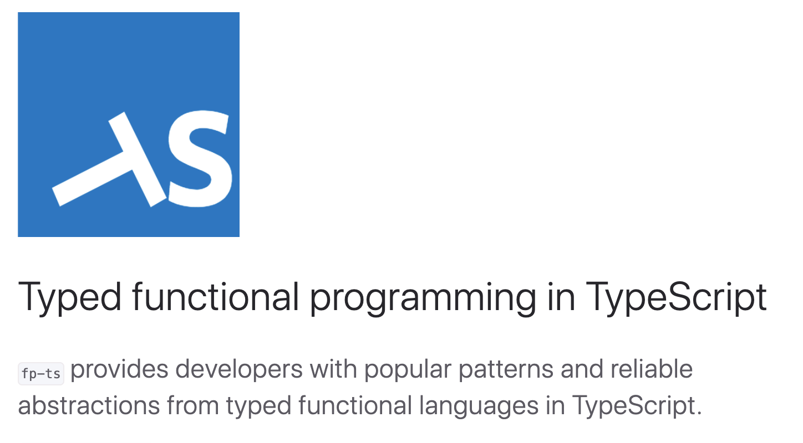

build-lists: false
autoscale: true

## TypeScript & FP

### an introduction

---

# Intro to FP

| **OO**               | **FP**   |
| -------------------- | -------- |
| Dependency Injection | Function |
| Visitor Pattern      | Function |
| Decorator            | Function |
| Middleware           | Function |
| Factory              | Function |

---

### [fit] HKT

---

### [fit] ADT

---

### [fit] Monoid

---

### [fit] Functor

---

[.background-color: #fff]
[.text: #465062]
[.header: #465062]

_fp-ts_ typeclasses



---

[.list: alignment(left)]

# Agenda

<br />

1. Rules of typed FP in TS

2. Meet fp-ts

3. Type-driven design

4. Parsing

---



---

[.list: alignment(left)]

# Data

- plain values, no behavior attached
- generally immutable: different value ⟺ different reference

# Functions

- in the mathematical sense: no "impure" or "side-effectful" functions
- each element of the _domain_ maps to a single element of the _codomain_
- "total": defined for every value of the _domain_

---

[.build-lists: true]
[.list: alignment(left)]

## Typed functional programming in TS - Rules

- `"strict": true` in tsconfig.json
- annotate function return types
- define `total` functions
- when possible, prefer `polymorphic` functions
- use "type driven development": _`declare function`_

---

[.list: alignment(left)]

## Typed ~~functional~~ programming in TS - Rules

- `"strict": true` in tsconfig.json
- annotate function return types
- define `total` functions
- when possible, prefer `polymorphic` functions
- use "type driven development": _`declare function`_

---

Are these signatures OK?

<br />

```ts
declare function sum(a: number, b: number): number;

declare function length(a: string): number;

declare function replicate<A>(a: A, n: number): Array<A>;
```

---

## Are these signatures OK?

<br />

```ts
declare function parseInt(s: string): number;

declare function head<A>(as: Array<A>): A;
```

---

## Meet composition in fp-ts

<br />

# pipe _and_ flow

---

### Plain JS/TS composition

```ts
result = length(double("foo"));
```

<br />

### Using the "pipe" operator, e.g. in `F#`

```ts
result = "foo" |> double |> length
```

---

### Using `pipe` from `fp-ts`

```ts
import { pipe } from "fp-ts/function";

result = pipe("foo", double, length);
```

<br />

### Using `flow` from `fp-ts`

```ts
import { flow } from "fp-ts/function";

const doubleLength = flow(double, length);

const result = doubleLength("foo");
```

---

[.list: alignment(left)]

## Car rental form _example_

- e-mail
- payment mode _at pickup or online (now)_
- age range _18-25-27+_
- _email is only required if paying "online"_
- _at form submit, display the total price based on user input_

---

# Product type

```ts
type PaymentMode = "online" | "pickup";

type AgeRange = "18-25" | "25-27" | "27+";

type ConfirmRent = {
  ageRange: AgeRange;
  paymentMode: PaymentMode;
  email?: string;
};
```

---

# Product type

### _allows impossible states_

```ts
export const payload1: ConfirmRent = {
  paymentMode: "pickup",
  ageRange: "18-25",
};

export const payload2: ConfirmRent = {
  paymentMode: "online",
  ageRange: "18-25",
};
```

---

# Sum type

```ts
export type OnlinePayment = {
  paymentMode: "online";
  ageRange: AgeRange;
  email: string;
};

export type PickupPayment = {
  paymentMode: "pickup";
  ageRange: AgeRange;
};

export type ConfirmRent = OnlinePayment | PickupPayment;
```

---

# Sum type

### _represents possible states only_

```ts
export const payload3: ConfirmRent = {
  paymentMode: "pickup",
  ageRange: "18-25",
  email: "test@example.com", // correctly errors now
};

export const payload4: ConfirmRent = {
  paymentMode: "online",
  ageRange: "18-25",
};
// Property 'email' is missing in type '{ ... }'
// but required in type 'OnlinePayment'
```

---

[.list: alignment(left)]

# Sum types in TS _recap_

<br />

- encoded as "discriminated unions"
- make impossible states not representable
- exhaustiveness checking
- use helper libs to reduce the boilerplate

---

# Validation

```ts
function isFormValid(formState: FormState): boolean;
```

<br />

Does not preserve information at type-level,

_forcing the caller to "cast"_

```ts
if (isFormValid(formState)) {
  formState.email; // could still be undefined from TS perspective
}
```

---

# Parsing

```ts
function parseFormState(formState: FormState): Option<ValidState>;
```

<br />

Preserves information at type-level

```ts
pipe(
  formState,
  parseFormState,
  option.fold(
    () => "Invalid",
    (valid) => valid.email // TS knows this is defined
  )
);
```

---

[.list: alignment(left)]

# Parsing in TS _recap_

- using parsers, there is no need for casts
- parsers encode in the return type the valid type
- `io-ts` simplifies writing parsers

---

# Links

- [slides+code](https://github.com/giogonzo/functional-fest)
- [FP intro by @gcanti](https://github.com/gcanti/functional-programming)
- [fp-ts](https://github.com/gcanti/fp-ts)/[io-ts](https://github.com/gcanti/io-ts)
- [fp-ts ecosystem](https://gcanti.github.io/fp-ts/ecosystem/)/[fp-ts learning resources](https://gcanti.github.io/fp-ts/learning-resources/)
- [Domain modeling made functional](https://www.youtube.com/watch?v=PLFl95c-IiU)
- [Parse, don't validate](https://lexi-lambda.github.io/blog/2019/11/05/parse-don-t-validate/)
- [FP-chat slack, #typescript and #fp-ts channels](https://fpchat-invite.herokuapp.com/)

---

[.background-color: #fff]
[.text: #465062]
[.header: #465062]

### [@giogonzo](https://twitter.com/giogonzo)

## **any** question?


